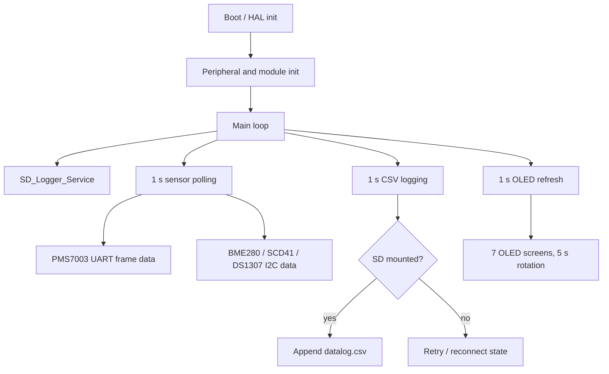

# STM32 Environment Data Logger

This is an STM32F103-based environment data logger. It reads data from PMS7003, BME280,
SCD41, and DS1307 modules, rotates the measured values on an SSD1306 OLED, and stores
CSV logs on a microSD card.

## Architecture

```text
[PMS7003]      -- UART --> STM32F103
[BME280]       -- I2C  --> STM32F103
[SCD41]        -- I2C  --> STM32F103
[DS1307]       -- I2C  --> STM32F103
[SSD1306 OLED] -- I2C  --> STM32F103
[SD Card]      -- SPI  --> STM32F103
```



## Features

- PMS7003 UART interrupt reception.
- PMS7003 active-mode 32-byte frame parsing with frame length and checksum validation.
- PMS7003 CF=1 PM, atmospheric PM, particle count, and reserved fields are stored.
- BME280 temperature, humidity, and pressure measurement.
- SCD41 CO2, temperature, and humidity measurement.
- DS1307 RTC timestamp reading.
- SSD1306 128x64 OLED display through U8g2.
- SD card CSV logging through FatFs.
- SD mount/write/close error tracking and retry/reconnect handling.
- `HAL_GetTick()` based main-loop scheduling.

## OLED Screens

The OLED is refreshed every 1 second. The visible screen changes every 5 seconds.

| Order | Screen | Contents |
| --- | --- | --- |
| 1 | TIME | RTC date and time |
| 2 | DUST | PM1.0, PM2.5, PM10 atmospheric values |
| 3 | DUST MASS | CF=1 and atmospheric PM values |
| 4 | DUST COUNT / 0.1L | Particle counts by size |
| 5 | BME280 | Temperature, humidity, pressure |
| 6 | SCD41 | CO2, temperature, humidity |
| 7 | SD CARD | Logging state, retry state, diagnostics |

## SD Logging

`Core/Src/sd_logger.c` manages SD mount state, CSV formatting, write attempts, and retry state.
The low-level SPI SD card access is implemented in `Core/Src/fatfs_sd.c`, while the FAT filesystem
itself is handled by the third-party FatFs middleware.

Each log row is appended to `datalog.csv`:

```text
20YY/MM/DD,HH:MM:SS,temp,humi,pressure,co2,
pm1.0_cf1,pm2.5_cf1,pm10_cf1,
pm1.0_atm,pm2.5_atm,pm10_atm,
particles_0.3um,particles_0.5um,particles_1.0um,
particles_2.5um,particles_5.0um,particles_10um
```

When an SD operation fails, the logger enters retry state:

- Wait 10 seconds.
- Show `Retry in n sec` on OLED.
- Enter `Reconnecting...` for the remount attempt.
- Retry low-level SD initialization and FatFs mount.
- Resume logging when mount succeeds.

SD card hot-swap is not actively recommended, but the logger should not permanently stop when
temporary contact failure occurs. If SD mount/write fails, the logger unmounts and deinitializes
the SD driver, then enters a retry state. A 10-second retry delay is used to avoid repeatedly
accessing the card while the user is reseating it or while the contact state is unstable.

This is intended to prevent scenarios where the logger works for a while, then loses all later
data because of a temporary SD contact failure after the user leaves the device unattended.

The SD screen also exposes diagnostic fields:

| Field | Meaning |
| --- | --- |
| `F` | Last FatFs `FRESULT` code |
| `S` | Last SD logger error stage |
| `D` | Last low-level disk result |
| `C` | Last SD command |
| `R` | Last SD command response |
| `T` | Last SD data token |

## Hardware

| Part | Role | Interface |
| --- | --- | --- |
| STM32F103C8T6 | Main MCU | - |
| PMS7003 | Dust sensor | UART |
| BME280 | Temperature / humidity / pressure sensor | I2C |
| SCD41 | CO2 sensor | I2C |
| DS1307 | RTC module | I2C |
| SSD1306 OLED | Display | I2C |
| SD Card Module | CSV logging | SPI |

## Wiring

| Module | Signal | STM32F103 Pin | Interface |
| --- | --- | --- | --- |
| PMS7003 | TX | PA10 / USART1_RX | UART |
| PMS7003 | RX | PA9 / USART1_TX | UART |
| BME280 | SDA | PB7 / I2C1_SDA | I2C |
| BME280 | SCL | PB6 / I2C1_SCL | I2C |
| SCD41 | SDA | PB7 / I2C1_SDA | I2C |
| SCD41 | SCL | PB6 / I2C1_SCL | I2C |
| DS1307 | SDA | PB7 / I2C1_SDA | I2C |
| DS1307 | SCL | PB6 / I2C1_SCL | I2C |
| SSD1306 OLED | SDA | PB7 / I2C1_SDA | I2C |
| SSD1306 OLED | SCL | PB6 / I2C1_SCL | I2C |
| SD Card | SCK | PA5 / SPI1_SCK | SPI |
| SD Card | MISO | PA6 / SPI1_MISO | SPI |
| SD Card | MOSI | PA7 / SPI1_MOSI | SPI |
| SD Card | CS | PA4 / GPIO_Output | SPI |
| On-board LED | LED | PC13 | GPIO |

Check module voltage levels before wiring. STM32F103 uses 3.3 V logic. Some SD card modules
include level shifters, but bare modules may not.

## Source Structure

| Path | Purpose |
| --- | --- |
| `Core/Src/main.c` | Main loop, scheduling, OLED UI |
| `Core/Src/pms7003.c` | PMS7003 UART frame reception and parsing |
| `Core/Src/bme280.c` | BME280 sensor driver |
| `Core/Src/scd41.c` | SCD41 sensor driver |
| `Core/Src/ds1307.c` | DS1307 RTC driver |
| `Core/Src/sd_logger.c` | CSV formatting and SD retry state |
| `Core/Src/fatfs_sd.c` | SPI SD card low-level driver |
| `Middlewares/Third_Party/FatFs` | Third-party FatFs filesystem |
| `Middlewares/Third_Party/u8g2` | Third-party U8g2 display library |

## Build

### VS Code

The repository includes a VS Code build task:

```text
Terminal > Run Build Task
```

or:

```text
Ctrl + Shift + B
```

The default task runs the root `Makefile`:

```powershell
make build
```

The `Makefile` uses the CMake `Debug` preset internally. Make sure `make`, `cmake`, `ninja`, and
`arm-none-eabi-gcc` are available in `PATH`. The ARM GCC toolchain can be provided by STM32CubeIDE
or another GNU Arm Embedded toolchain installation.

### STM32CubeIDE

1. Open STM32CubeIDE.
2. Import this folder as an existing STM32CubeIDE project.
3. Check that the target MCU is `STM32F103C8T6`.
4. Build the `Debug` configuration.
5. Flash using ST-Link or a compatible programmer.

### Manual Flash

After a successful Debug build, flash the generated ELF through the root `Makefile`:

```powershell
make flash
```

`make flash` expects `STM32_Programmer_CLI.exe` to be available in `PATH`. If it is installed
elsewhere, pass the path explicitly:

```powershell
make flash PROGRAMMER="C:/ST/STM32CubeIDE_2.1.1/STM32CubeIDE/plugins/com.st.stm32cube.ide.mcu.externaltools.cubeprogrammer.win32_2.2.400.202601091506/tools/bin/STM32_Programmer_CLI.exe"
```

## Coding Style

See `docs/CODING_STYLE.md`.

Project-owned C code uses 4 spaces for indentation and braces on their own line. Third-party and
vendor code under `Drivers/` and `Middlewares/` should not be reformatted unless there is a
specific reason.

## Design Notes

- STM32 HAL is used for UART, I2C, SPI, GPIO, clock, and interrupt setup.
- PMS7003 UART reception uses `HAL_UART_Receive_IT()` and `HAL_UART_RxCpltCallback()`.
- Long operations such as SD writes, OLED refresh, and I2C sensor reads are kept out of interrupt
  context.
- FatFs is used for the filesystem instead of implementing FAT manually.
- U8g2 is used for OLED drawing and font handling.

## License Notes

This section is an engineering summary of the licenses found in the repository, not a legal
review. No project-wide root `LICENSE` file is currently included. Before public release, product
delivery, or commercial use, choose a root license for project-authored code and keep third-party
license notices with the distributed source or binary materials.

Third-party and vendor code remains under its original license and is not relicensed by this
project.

| Component | Path | License note |
| --- | --- | --- |
| Project-authored application code | `Core/Src/*.c`, `Core/Inc/*.h` except generated/vendor files | Root project license is not yet selected |
| STM32 HAL driver | `Drivers/STM32F1xx_HAL_Driver` | ST package license applies; if received outside a package or without package terms, BSD-3-Clause applies |
| CMSIS core | `Drivers/CMSIS` | Apache License 2.0 |
| CMSIS STM32F1 device files | `Drivers/CMSIS/Device/ST/STM32F1xx` | ST package license applies; if received outside a package or without package terms, Apache License 2.0 applies |
| FatFs R0.11 | `Middlewares/Third_Party/FatFs` | ChaN permissive license; retain the copyright notice, condition, and disclaimer |
| U8g2 core | `Middlewares/Third_Party/u8g2` | BSD-style permissive license; retain copyright, conditions, and disclaimer |
| U8g2 fonts currently used | `u8g2_font_5x7_tr`, `u8g2_font_6x10_tr`, `u8g2_font_7x13_tr` | Marked as public domain in `u8g2_fonts.c` |

The U8g2 font collection contains many fonts with different origins and license terms. Only the
currently selected public-domain bitmap fonts should be used unless another font license has been
reviewed.

## AI-assisted Documentation

AI assistance was used to draft and refine this Markdown documentation for writing convenience.
The technical content should still be reviewed against the source code, datasheets, and official
library documentation before submission or release.

## Known Limitations

- SD card behavior depends heavily on wiring quality, card format, and SPI signal integrity.
- OLED refresh and FatFs write calls still use blocking HAL/FatFs operations internally, so update
  frequency is intentionally limited.
- Logs are currently appended to a single `datalog.csv` file. At the current one-record-per-second
  logging rate and CSV row size, a 4 GB card is roughly enough for about 2.5 years of theoretical
  data, so one month of logging has large storage margin. Actual duration still depends on card
  capacity, filesystem overhead, row length, and future sensor fields.
- CSV logging can be improved later by buffering records into 512-byte blocks to reduce SD write
  frequency. The current design opens, writes, and closes the file for every record to keep the
  code simple and minimize data loss if power is suddenly removed.
- Long-term logging can be improved later by splitting files by date, for example
  `log_2026_06_05.csv`.
- Low-cost STM32F103 boards may use clone or relabeled chips.
- Open-source library and font licenses should be checked before product or public release.
- Build tools must be available in `PATH` for the Makefile, CMake presets, and VS Code build task.

## References

### STM32 / HAL

- STMicroelectronics, [RM0008 Reference Manual - STM32F101xx, STM32F102xx, STM32F103xx,
  STM32F105xx and STM32F107xx advanced Arm-based 32-bit MCUs](https://www.st.com/resource/en/reference_manual/rm0008-stm32f101xx-stm32f102xx-stm32f103xx-stm32f105xx-and-stm32f107xx-advanced-armbased-32bit-mcus-stmicroelectronics.pdf).
  - Used for RCC clock tree, USART, I2C, SPI, GPIO, timer and register-level behavior.
- STMicroelectronics, [UM1850 - Description of STM32F1 HAL and low-layer drivers](https://www.st.com/resource/en/user_manual/um1850-description-of-stm32f1-hal-and-lowlayer-drivers-stmicroelectronics.pdf).
  - Used for the HAL/LL driver model, handle-based peripheral APIs, and interrupt/callback behavior.
- STMicroelectronics, [UM2609 - STM32CubeIDE user guide](https://www.st.com/resource/en/user_manual/dm00629856-stm32cubeide-user-guide-stmicroelectronics.pdf).
  - Used for CubeIDE project generation, build/debug workflow, and source navigation.

### FatFs

- ChaN, [FatFs - Generic FAT Filesystem Module](https://elm-chan.org/fsw/ff/).
  - Used as embedded FAT/exFAT filesystem middleware for SD card logging.
- ChaN, [FatFs `f_mount` documentation](https://elm-chan.org/fsw/ff/doc/mount.html).
  - Used to understand filesystem object registration and logical drive mount/unmount.
- ChaN, [FatFs `f_open` documentation](https://elm-chan.org/fsw/ff/doc/open.html).
  - Used to open or create `datalog.csv` for append logging.
- ChaN, [FatFs `f_write` documentation](https://elm-chan.org/fsw/ff/doc/write.html).
  - Used to implement CSV write handling and byte-count verification.
- ChaN, [FatFs `f_close` documentation](https://elm-chan.org/fsw/ff/doc/close.html).
  - Used to understand file close behavior and cached metadata write-back.
- ChaN, [FatFs `f_sync` documentation](https://elm-chan.org/fsw/ff/doc/sync.html).
  - Used to evaluate data logger reliability trade-offs and flush behavior.

### PMS7003

- Plantower, [PMS7003 product page](https://plantower.com/en/products_33/76.html).
  - Used for sensor-level specifications such as particle range, response time, supply voltage,
    and interface level.
- Plantower, [PMS7003 series data manual English V2.5](https://www.imiconsystem.com/wp-content/uploads/2020/10/p564008-PMS7003-series-data-manua_English_V2.5.pdf).
  - Used for UART frame format, `0x42 0x4D` header, `0x001C` frame length, checksum,
    active/passive mode commands, and particle count fields.
- Linux kernel, [PMS7003 driver `drivers/iio/chemical/pms7003.c`](https://codebrowser.dev/linux/linux/drivers/iio/chemical/pms7003.c.html).
  - Used as an additional reference for packet constants, frame validation, checksum handling,
    and command format.

### Display

- U8g2, [project documentation](https://github.com/olikraus/u8g2/wiki).
  - Used for SSD1306 setup, display buffer handling, drawing API usage, and font selection.
